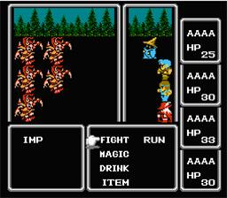

  

  

    A Awesome RPG inspired in Tibia Online, Final Fantasy Classics, Game Of Throne, Star Wars, and other nerd things *-*
     
  

  

## Table of Contents

- [How to use the program](#howtouse)
- [Inspiration](#references)
- [Reasons](#bestpractices)
- [References](#ides)
- [Tools](#tools)

# How to use the program
  
   

## Inspirations

- [Tibia Online](https://secure.tibia.com/news/?subtopic=latestnews)
- Final Fantasy Classics
- Game Of Thrones
- Star Wars
- <strong> Play for discovery more spoilers haha </strong>

## Reasons

- Learn POO with Python
- Learn Best Practices with Python
- Refactor the code over the years
- Learn TDD with Python

## References

- [Curso Em Video - Python Course](https://www.cursoemvideo.com/course-cat/python/)
- [Ignorancia Zero - Youtube](https://www.youtube.com/channel/UCmjj41YfcaCpZIkU-oqVIIw)

## Tools

- [Lubuntu](https://lubuntu.net/)
- [Bash](https://www.google.com.br/search?q=bash&oq=bash&aqs=chrome..69i57l2j69i65l3j69i60.422j0j7&sourceid=chrome&ie=UTF-8)
- [Sublime Text](https://www.sublimetext.com/)

