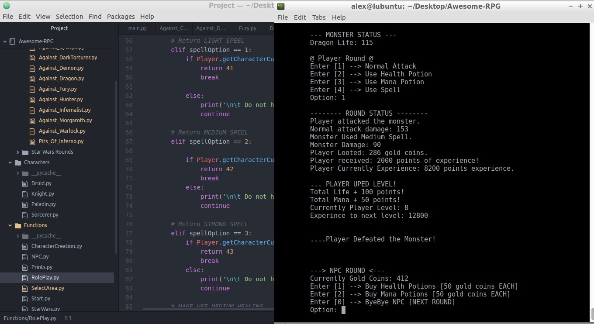

<h2 align="center"> Awesome RPG </h2>

  

  

    A simple command line but very funny RPG Turn Game. Have Fun. :smile:
     
  

## Table of Contents

- [How to use the program](#how-to-use-the-program)
- [Inspirations](#inspirations)
- [Reasons](#reasons)
- [References](#references)
- [Tools Used](#tools-used)
- [Game Prints](#game-prints)
- [Copyright and License](#copyright-and-license)

# How to use the program

     git clone https://github.com/AlexGalhardo/Awesome-RPG.git
     cd Awesome-RPG
     python3 main.py

## Inspirations

- [Tibia Online](https://secure.tibia.com/news/?subtopic=latestnews) - The best game of all time. Which introduced me to the programming world. :heart:
- Final Fantasy Classics
- Game Of Thrones
- Star Wars
- <strong> Play for discovery more spoilers :satisfied: </strong>

## Reasons

- Learn POO with Python
- Learn how to document code in Python
- Learn best practices with Python
- Refactor the code over the years, improving the algorithm and adding new features
- Learn to apply TDD in Python
- Learn to apply automated testing in Python
- Increase productivity with Python
- Learn how to maintain a legacy system with Python
- Play in my spare time :video_game:

## To Do

 - Game Areas
    - [ ] Complete Pits Of Inferno Area [EASY]
    - [ ] Complete Game of Thrones Area [MEDIUM]
    - [ ] Complete Star Wars Area [HARD]
  
  - Global
     - [x] Use modules importation
     - [ ] Apply Clean Code principles
     - [ ] Use Try, Exceptions and Finally
     - [x] Use Global Variables 
     - [ ] Apply Test Driven Development
   
   - Object-Oriented Programming
     - [x] Use Abstraction
     - [x] Use Encapsulation
     - [x] Use Herance
     - [x] Use Polymorfism
     - [ ] Apply S.O.L.I.D principles.
        - [ ] Single responsibility principle
           -   A class should have one and only one reason to change, meaning that a class should only have one job.
        - [ ] Open-closed Principle
           - Objects or entities should be open for extension, but closed for modification.
        - [ ] Liskov substitution principle
           - Objects in a program should be replaceable with instances of their subtypes without altering the correctness of that program
        - [ ] Interface segregation principle
           - A client should never be forced to implement an interface that it doesn’t use or clients shouldn’t be forced to depend on methods they do not use.
        - [ ] Dependency inversion principle
           - Entities must depend on abstractions not on concretions. It states that the high level module must not depend on the low level module, but they should depend on abstractions.
 
   
   - Game Statistics
     - [ ] Save in a SQL Database some game statistics using static methods and variables, like:
        - Total game time until player dies
        - Total damage to monsters
        - Total damage taken from monsters
        - Total Mana used
        - Total Spells used
        - Total attacks used
        - Total health potions used
        - Total mana potions used
        - Total gold coins looted
        - Total gold coins used
      - [ ] Get the statistics from the database and save it to a file "game-statistics.txt"
        

## Tools Used

- [Lubuntu](https://lubuntu.net/)
- [Bash](https://www.google.com.br/search?q=bash&oq=bash&aqs=chrome..69i57l2j69i65l3j69i60.422j0j7&sourceid=chrome&ie=UTF-8)
- [Atom](https://atom.io/)
- [PyTest](https://docs.pytest.org/en/latest/)

<h2 align="center"> Game Prints </h2>

  

    Alpha Version 0.3.6 - 10/05/2018
  

    
  </a>

## Copyright and License

Code and documentation copyright 2018 [Alex Galhardo](https://github.com/AlexGalhardo). Code released under the [MIT License](https://github.com/AlexGalhardo/Awesome-RPG/blob/master/LICENSE).
